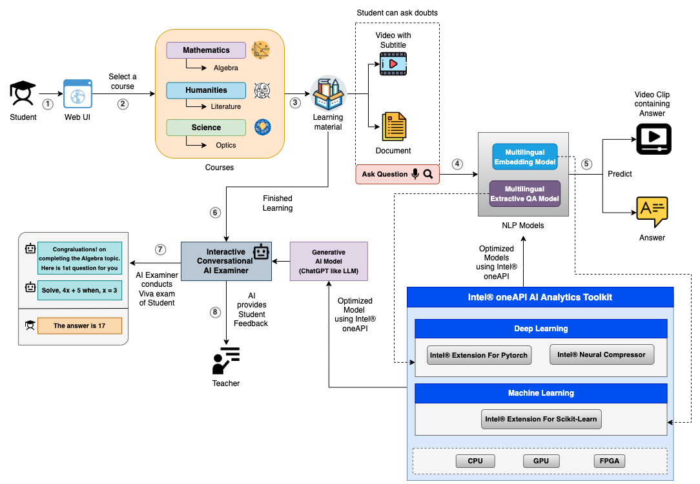

### Team Name - C5ailabs
### Problem Statement - Open Innovation in Education
### Team Leader Email - rohit.sroch@course5i.com

# LEAP

Intel Hackathon Prototype Implementation for our LEAP Platform

## A Brief of the Prototype:

#### INSPIRATION 

MOOCs (Massive Open Online Courses) have surged in popularity in recent years, particularly during the COVID-19 pandemic. These
online courses are typically free or low-cost, making education more accessible worldwide.

- Online learning is crucial for students even post-pandemic due to its flexibility, accessibility, and quality. But still, the learning experience
  for students is not optimal, as in case of doubts they need to repeatedly go through videos and documents or ask in the forum which may
  not be effective because of the following challenges:

  - Resolving doubts can be a time-consuming process.
  - It can be challenging to sift through pile of lengthy videos or documents to find relevant information.
  - Teachers or instructors may not be available around the clock to offer guidance

- To mitigate the above challenges, we propose LEAP (Learning Enhancement and Assistance Platform), which is an AI-powered
  platform designed to enhance student learning outcomes and provide equitable access to quality education. The platform comprises two main features that aim to improve the overall learning experience of the student:

#### Our Proposed Solution 

LEAP stands for Learning Enhancement and Assistance Platform:

❑ Ask Question/Doubt: This allows the students to ask real-time questions around provided reading material, which includes videos and
documents, and get back answers along with the exact timestamp in the video clip containing the answer (so that students don’t have to
always scroll through). Also, It supports asking multilingual question, ensuring that language barriers do not hinder a student's learning
process.

❑ Interactive Conversational AI Examiner: This allows the students to evaluate their knowledge about the learned topic through an AI
examiner conducting viva after each learning session. The AI examiner starts by asking question and always tries to motivate and provide
hints to the student to arrive at correct answer, enhancing student engagement and motivation.

## Detailed LEAP Process Flow:

## Tech Stack:

  - Intel® oneAPI (Intel® AI Analytics Toolkit)  Tech Stack

  

    1. Intel® Extension for Pytorch: Used for Multilingual Extractive QA model training optimization.
    2. Intel® Neural Compressor: Used for Multilingual Extractive QA model inference and Generative AI model inference optimization.
    3. Intel® Extension for Scikit-Learn: Used for Multilingual Embedding model training optimization.
    4. Intel® distribution for Modin: Used for basic initial data analysis/EDA.
    5. Intel® optimized Python: Used for data pre-processing, reading etc.

  - Base Tech Stack

  

   List Down all technologies used to Build the prototype **Clearly mentioning Intel® AI Analytics Toolkits, it's libraries and the SYCL/DCP++ Libraries used**
   
## Step-by-Step Code Execution Instructions:
  Stay Tuned!
  
# What I learned 

✅ Building application using Intel® AI Analytics Toolkit: The Intel® AI Analytics Toolkit gives data scientists, AI developers, and researchers familiar Python* tools and frameworks to accelerate end-to-end data science and analytics pipelines on Intel® architecture. The components are built using oneAPI libraries for low-level compute optimizations. This toolkit maximizes performance from preprocessing through deep learning, machine learning, and provides interoperability for efficient model development.

✅ Easy to Adapt: The Intel® AI Analytics Toolkit requires minimal changes to adapt to a machine learning, deep learning workloads.

✅Collaboration: Building a project like this likely required collaboration with a team of experts in various fields, such as deep learning, and data analysis, and I likely learned the importance of working together to achieve common goals.

These are just a few examples of the knowledge and skills that i likely gained while building this project. 
Overall, building a helpful platform like LEAP is a challenging and rewarding experience that requires a combination of technical expertise and agricultural knowledge.