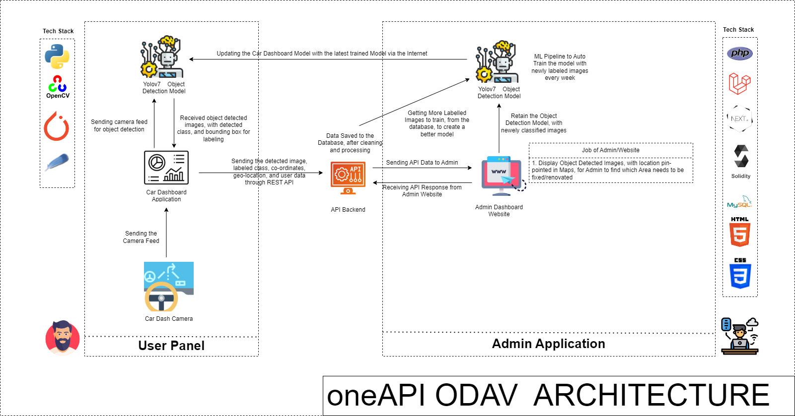

# intel-oneAPI

#### Team Name - Hitaya
#### Problem Statement - Object Detection For Autonomous Vehicles <a href="https://www.youtube.com/watch?v=aCLAOy6iWAs">(DEMO)<a/>
#### Team Leader Email - manijb13@gmail.com

## A Brief of the Prototype:
  This section must include UML Daigrms and prototype description
  
<p align="center">
  
</p>
  
## Tech Stack: 
   List Down all technologies used to Build the prototype **Clearly mentioning Intel® AI Analytics Toolkits, it's libraries and the SYCL/DCP++ Libraries used**
   - Intel® AI Analytics Toolkits

   
## Step-by-Step Code Execution Instructions:
  This Section must contain set of instructions required to clone and run the prototype, so that it can be tested and deeply analysed
  
## What I Learned:
   Write about the biggest learning you had while developing the prototype


<h1 align="center">oneAPI_ODAV</h1>

## Features
-  Car Dashboard Application, to detect objects after detection from, the yolov7 model.
-  We have used Tiny Yolov7 Model Architecture to ensure, the car dashcam requires very less, hardware configuration to run the application.
-  Custom Labelling tool, to self Label the Application.
-  Sending of data points once connected to the internet, like userid, detected_image, label, bounding_box_co-ordinate, latitude, and longitude through rest API.
-  Rest API saves the real-time data, in the database, and sends the data to Admin Web Interface.
-  Auto Train the custom-yolov7 model, with new data points every week, and update the car dashboard Application over the internet, to improve the accuracy of the model over time.

- Install Python 3.10 and its required Packages like PyTorch etc.


## 1. Project Architecture

<p align="center">
  
</p>

## 2. Train the YoloV7 Object Detection Model

### Open Image Labelling Tool

```commandline
labelImg
```

### Add more data from the already labelled images

```
git clone https://github.com/IntelegixLabs/smartathon-dataset
cd smartathon-dataset
Add train,val, and test data to oneAPI_ODAV/yolov7-custom/data files 
```

### Train the custom Yolov7 Model

```commandline
git clone https://github.com/IntelegixLabs/oneAPI_ODAV
cd oneAPI_ODAV
cd yolov7-custom
pip install -r requirements.txt
pip install -r requirements_gpu.txt
pip3 install torch torchvision torchaudio --extra-index-url https://download.pytorch.org/whl/cu117
python train.py --workers 1 --device 0 --batch-size 8 --epochs 100 --img 640 640 --data data/custom_data.yaml --hyp data/hyp.scratch.custom.yaml --cfg cfg/training/yolov7-custom.yaml --name yolov7-custom --weights yolov7.pt

```
## 3. Getting Started With Car Dash Board Application

- Clone the repo and cd into the directory
```sh
$ git clone https://github.com/IntelegixLabs/oneAPI_ODAV.git
$ cd oneAPI_ODAV
$ cd oneAPI_ODAV_App
```
- Download the Trained Models and Test_Video Folder from google Drive link given below and extract it inside oneAPI_ODAV_App Folder
- https://drive.google.com/file/d/1YXf8kMjowu28J5Z_ZPXoRIDABRKzmHis/view?usp=sharing

```sh
$ wget https://drive.google.com/file/d/1YXf8kMjowu28J5Z_ZPXoRIDABRKzmHis/view?usp=sharing
```

- Install Python 3.10 and its required Packages like PyTorch etc.

```sh
$ pip install -r requirements.txt
$ pip intsall -r requirements_gpu.txt
$ pip3 install torch torchvision torchaudio --extra-index-url https://download.pytorch.org/whl/cu117
```

- Run the app

```sh
$ python home.py
```


### Packaging the Application for Creating a Execulatle exe File that can run in Windows,Linus,or Mac OS

You can pass any valid `pyinstaller` flag in the following command to further customize the way your app is built.
for reference read the pyinstaller documentation <a href="https://pyinstaller.readthedocs.io/en/stable/usage.html">here.</a>

```sh
$ pyinstaller -i "favicon.ico" --onefile -w --hiddenimport=EasyTkinter --hiddenimport=Pillow  --hiddenimport=opencv-python --hiddenimport=requests--hiddenimport=Configparser --hiddenimport=PyAutoGUI --hiddenimport=numpy --hiddenimport=pandas --hiddenimport=urllib3 --hiddenimport=tensorflow --hiddenimport=scikit-learn --hiddenimport=wget --hiddenimport=pygame --hiddenimport=dlib --hiddenimport=imutils --hiddenimport=deepface --hiddenimport=keras --hiddenimport=cvlib --name oneAPI_ODAV home.py
```


## 4. Working Samples 

- For Video Demostration refer to the YouTube link <a href="https://www.youtube.com/watch?v=o_VaF7S8ptM](https://www.youtube.com/watch?v=aCLAOy6iWAs">here.</a>

### GUI INTERFACE SAMPLES

<p align="center">
    
    
</p>

### THEME 1 (Detection and evaluation of the following elements on street imagery taken from a moving vehicle) :camera_flash:


Object types:

```
 ● PERSON
 ● BICYCLE
 ● CAR
 ● MOTORCYCLE
 ● BUS
 ● TRUCK
 ● TRAFFIC LIGHT
 ● STOP SIGN
 ● PARKING METER
 ● POTTED PLANT
 ● CLOCK
```

<p align="center">
    
</p>


### Car Dashboard Custom Image Labelling Tool 


<p align="center">
    
</p>


