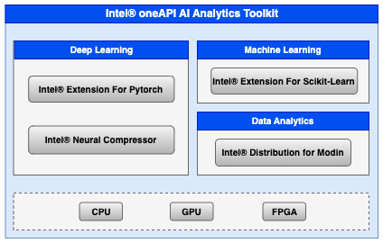
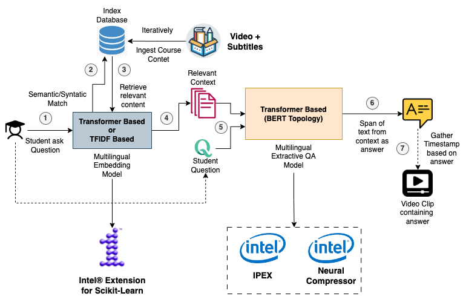
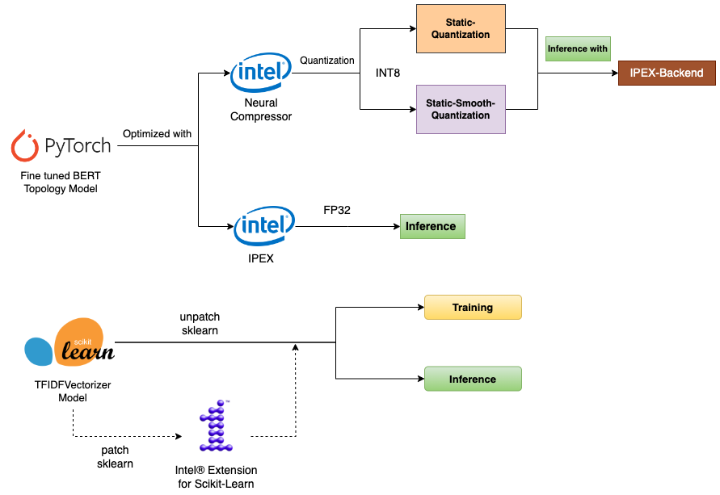

### Team Name - C5ailabs
### Problem Statement - Open Innovation in Education
### Team Leader Email - rohit.sroch@course5i.com
### PPT - https://github.com/rohitc5/intel-oneAPI/blob/main/ppt/Intel-oneAPI-Hackathon-Implementation.pdf
### Medium Article - https://medium.com/@rohitsroch/leap-learning-enhancement-and-assistance-platform-powered-by-intel-oneapi-ai-analytics-toolkit-656b5c9d2e0c
### Benchmark Results - https://github.com/rohitc5/intel-oneAPI/tree/main/benchmark
### Demo Video - https://www.youtube.com/watch?v=QoVWsOSlwvI

<hr>

# LEAP

Intel® oneAPI Hackathon 2023 - Prototype Implementation for our LEAP Solution

# A Brief of the Prototype:

#### INSPIRATION 


MOOCs (Massive Open Online Courses) have surged in popularity in recent years, particularly during the COVID-19 pandemic. These
online courses are typically free or low-cost, making education more accessible worldwide.

Online learning is crucial for students even post-pandemic due to its flexibility, accessibility, and quality. But still, the learning experience for students is not optimal, as in case of doubts they need to repeatedly go through videos and documents or ask in the forum which may not be effective because of the following challenges:

- Resolving doubts can be a time-consuming process.
- It can be challenging to sift through pile of lengthy videos or documents to find relevant information.
- Teachers or instructors may not be available around the clock to offer guidance

#### PROPOSED SOLUTION 

To mitigate the above challenges, we propose LEAP (Learning Enhancement and Assistance Platform), which is an AI-powered
platform designed to enhance student learning outcomes and provide equitable access to quality education. The platform comprises two main features that aim to improve the overall learning experience of the student:

❑ Ask Question/Doubt: This allows the students to ask real-time questions around provided reading material, which includes videos and
documents, and get back answers along with the exact timestamp in the video clip containing the answer (so that students don’t have to
always scroll through). Also, It supports asking multilingual question, ensuring that language barriers do not hinder a student's learning
process.

❑ Interactive Conversational AI Examiner: This allows the students to evaluate their knowledge about the learned topic through an AI
examiner conducting viva after each learning session. The AI examiner starts by asking question and always tries to motivate and provide
hints to the student to arrive at correct answer, enhancing student engagement and motivation.

# Detailed LEAP Process Flow:


# Technology Stack:

  - Intel® oneAPI AI Analytics Toolkit Tech Stack

  

    1. Intel® Extension for Pytorch: Used for our Multilingual Extractive QA model Training/Inference optimization.
    2. Intel® Neural Compressor: Used for Multilingual Extractive QA model and Generative AI model Inference optimization.
    3. Intel® Extension for Scikit-Learn: Used for Multilingual Embedding model Training/Inference optimization.
    4. Intel® distribution for Modin: Used for basic initial data analysis/EDA.
    5. Intel® optimized Python: Used for data pre-processing, reading etc.

  - Prototype webapp Tech Stack

  

# Demo Video

[](https://www.youtube.com/watch?v=QoVWsOSlwvI)

# Step-by-Step Code Execution Instructions:

### Quick Setup Option

- Make sure you have already installed docker (https://docs.docker.com/get-docker/) and docker-compose (https://docs.docker.com/compose/)

- Clone the Repository
```python
 $ git clone https://github.com/rohitc5/intel-oneAPI/
 $ cd intel-oneAPI

```
- Start the LEAP RESTFul Service to consume both components (Ask Question/Doubt and Interactive Conversational AI Examiner) as a REST API. 
Also Start the webapp demo build using streamlit.

```python
  # copy the dataset
  $ cp -r ./dataset webapp/ 

  # build using docker compose
  $ docker-compose build
  
  # start the services
  $ docker-compose up 
```

- Go to http://localhost:8502


### Manual Setup Option

- Clone the Repository

```python
 $ git clone https://github.com/rohitc5/intel-oneAPI/
 $ cd intel-oneAPI
```

- Train/Fine-tune the Extractive QA Multilingual Model (Part of our **Ask Question/Doubt** Component).
Please note that, by default we use this (https://huggingface.co/ai4bharat/indic-bert) as a Backbone (BERT topology)
and finetune it on SQuAD v1 dataset. Moreover, IndicBERT is a multilingual ALBERT model pretrained exclusively on 12 major Indian languages. It is pre-trained on novel monolingual corpus of around 9 billion tokens and subsequently evaluated on a set of diverse tasks. So finetuning, on SQuAD v1 (English) dataset automatically results in cross-lingual
transfer on other 11 indian languages.

Here is the architecture of `Ask Question/Doubt` component:



```python
  $ cd nlp/question_answering

  # install dependencies
  $ pip install -r requirements.txt
  
  # modify the fine-tuning params mentioned in finetune_qa.sh
  $ vi finetune_qa.sh

  ''''
  export MODEL_NAME_OR_PATH=ai4bharat/indic-bert
  export BACKBONE_NAME=indic-mALBERT-base
  export DATASET_NAME=squad # squad, squad_v2 (pass --version_2_with_negative)
  export TASK_NAME=qa

  # hyperparameters
  export SEED=42
  export BATCH_SIZE=32
  export MAX_SEQ_LENGTH=512
  export NUM_TRAIN_EPOCHS=5
  ...
  
  ''''

  # start the training after modifying params
  $ bash finetune_qa.sh
```

- Perform Post Training Optimization of Extractive QA model using IPEX (Intel® Extension for Pytorch), Intel® Neural Compressor and run the bennchmark for comparison with Pytorch(Base)-FP32

```python
  # modify the params in pot_benchmark_qa.sh
  $ vi pot_benchmark_qa.sh

  ''''
  export MODEL_NAME_OR_PATH=artifacts/qa/squad/indic-mALBERT
  export BACKBONE_NAME=indic-mALBERT
  export DATASET_NAME=squad # squad, squad_v2 (pass --version_2_with_negative)
  export TASK_NAME=qa
  export USE_OPTIMUM=True  # whether to use hugging face wrapper optimum around intel neural compressor

  # other parameters
  export BATCH_SIZE=8
  export MAX_SEQ_LENGTH=256
  export DOC_STRIDE=128
  export KEEP_ACCENTS=False
  export DO_LOWER_CASE=True
  export MAX_EVAL_SAMPLES=200

  export TUNE=True  # whether to tune or not
  export PTQ_METHOD="static_int8" # "dynamic_int8", "static_int8", "static_smooth_int8"
  export BACKEND="default" # default, ipex
  export ITERS=100
  ...

  ''''
  
  $ bash pot_benchmark_qa.sh

  # Please note that, above shell script can perform optimization using IPEX to get Pytorch-(IPEX)-FP32 model
  # or It can perform optimization/quantization using Intel® Neural Compressor to get Static-QAT-INT8, 
  # Static-Smooth-QAT-INT8 models. Moreover, you can choose the backend as `default` or `ipex` for INT8 models.

```

- Run quick inference to test the model output

```python
  $ python run_qa_inference.py --model_name_or_path=[FP32 or INT8 finetuned model]  --model_type=["vanilla_fp32" or "quantized_int8"] --do_lower_case  --keep_accents --ipex_enable

```

- Train/Infer/Benchmark TFIDFVectorizer Embedding model for Scikit-Learn (Base) vs Intel® Extension for Scikit-Learn

```python
  $ cd nlp/feature_extractor

  # train (.fit_transform func), infer (.transform func) and perform benchmark
  $ python run_benchmark_tfidf.py --course_dir=../../dataset/courses --is_preprocess 
  
  # now rerun but turn on  Intel® Extension for Scikit-Learn
  $ python run_benchmark_tfidf.py --course_dir=../../dataset/courses --is_preprocess  --intel_scikit_learn_enabled
```

- Setup LEAP API

```python
  $ cd api
  
  # install dependencies
  $ pip install -r requirements.txt

  $ cd src/

  # create a local vector store of course content for faster retrieval during inference
  # Here we get semantic or syntactic (TFIDF) embedding of each content from course and index it.
  # Please Note that, we use FAISS (local vector store) (https://github.com/facebookresearch/faiss) to create a course content index
  $ python core/create_vector_index.py --course_dir=../../dataset/courses --emb_model_type=[semantic or syntactic] \
      --model_name_or_path=[Hugging face model name for semantic] --keep_accents
  
  # update config.py
  $ cd ../ 
  $ vi config.py 
  
  ''''
    ASK_DOUBT_CONFIG = {
      # hugging face BERT topology model name
      "emb_model_name_or_path": "ai4bharat/indic-bert", 
      "emb_model_type": "semantic",  #options: syntactic, semantic
      
      # finetuned Extractive QA model path previously done
      "qa_model_name_or_path": "vanichandna/indic-bert-finetuned-squad", 
      "qa_model_type": "vanilla_fp32",  #options: vanilla_fp32, quantized_int8
      
      # faiss index file path created previously
      "faiss_vector_index_path": "artifacts/index/faiss_emb_index"
    }
    ...

  ''''

```

- For our **Interactive Conversational AI Examiner** Component, we use an Instruct-tuned or RLHF Large Language model (LLM) based on recent advancements in Generative AI. You can update the API configuration by specifying hf_model_name (LLM name available in huggingface Hub). Please checkout https://huggingface.co/models for LLMs.

Here is the architecture of `Interactive Conversational AI Examiner` component:


We can use several open access models from hugging face Hub like MPT-7B-instruct (https://huggingface.co/mosaicml/mpt-7b-instruct), Falcon-7B-instruct (https://huggingface.co/TheBloke/falcon-7b-instruct-GPTQ), etc. (follow https://huggingface.co/models for more options.) 

Here for performance gain, we can use INT8 quantized model optimized using Intel®  Neural Compressor (like https://huggingface.co/decapoda-research/llama-7b-hf-int8 etc.) 

Please Note that for fun 😄, we also provide usage of Azure OpenAI Service to use models like GPT3 with paid subscription API. You just need to provide `azure_deployment_name`, set `llm_name` as `azure_gpt3` in the below configuration and then add `<your_key>` 

```python

  AI_EXAMINER_CONFIG = {
      "llm_name": "azure_gpt3", # azure_gpt3, hf_pipeline
      "azure_deployment_name": "text-davinci-003",

      "hf_model_name": "TheBloke/falcon-7b-instruct-GPTQ", # mosaicml/mpt-7b-instruct

      "device": 0, # cuda:0
      "llm_kwargs":{
          "do_sample": True,
          "temperature": 0.5, 
          "max_new_tokens": 300,
          "top_p": 1.0,
          "top_k": 0,
          "repetition_penalty": 1.1,
          "num_return_sequences": 1,
          "stop_sequence": "<|endoftext|>"
    }
  ...

  os.environ["OPENAI_API_KEY"] = "<your_key>"
```

- Start the API server

```python
  $ cd api/src/
  
  # start the gunicorn server
  $ bash start.sh
```

- Start the Streamlit webapp demo

```python
  $ cd webapp

  # update the config
  $ vi config.py

  ''''
  # set the correct dataset path
  DATASET_COURSE_BASE_DIR = "../dataset/courses/"

  API_CONFIG = {
    "server_host": "localhost",
    "server_port": "8500",

  }
  ...

  ''''

  # install dependencies
  $ pip install -r requirements.txt

  $ streamlit run app.py

```

- Go to http://localhost:8502

# Benchmark Results with Intel® oneAPI AI Analytics Toolkit

- We follow the below process flow to optimize our models from both the components



- We have already added several benchmark results to compare how beneficial Intel® oneAPI AI Analytics Toolkit is compared to baseline. Please go to `benchmark` folder to view the results. Please Note that the shared results are based
on provided Intel® Dev Cloud machine *[Intel Xeon Processor (Skylake, IBRS) - 10v CPUs 16GB RAM]*

# Comprehensive Implementation PPT & Article

- Please go to PPT 🎉 https://github.com/rohitc5/intel-oneAPI/blob/main/ppt/Intel-oneAPI-Hackathon-Implementation.pdf for more details

- Please go to Article 📄 https://medium.com/@rohitsroch/leap-learning-enhancement-and-assistance-platform-powered-by-intel-oneapi-ai-analytics-toolkit-656b5c9d2e0c for more details
  
# What we learned 


✅ **Utilizing the Intel® AI Analytics Toolkit**: By utilizing the Intel® AI Analytics Toolkit, developers can leverage familiar Python* tools and frameworks to accelerate the entire data science and analytics process on Intel® architecture. This toolkit incorporates oneAPI libraries for optimized low-level computations, ensuring maximum performance from data preprocessing to deep learning and machine learning tasks. Additionally, it facilitates efficient model development through interoperability.

✅ **Seamless Adaptability**: The Intel® AI Analytics Toolkit enables smooth integration with machine learning and deep learning workloads, requiring minimal modifications.

✅ **Fostered Collaboration**: The development of such an application likely involved collaboration with a team comprising experts from diverse fields, including deep learning and data analysis. This experience likely emphasized the significance of collaborative efforts in attaining shared objectives.
