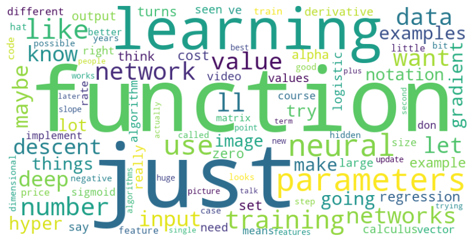

## Preprocess course dataset (To maintain minimum text length of each subtitle)

- Run the `preprocess_subtitle.py` script

```python
   $ cd utils

   $ python preprocess_subtitle.py --course_dir=../../dataset/courses --min_text_len=500
```

## Perform Basic EDA on course dataset

- Run the `run_eda.py` script

```python
 $ cd utils

 $ python run_eda.py --course_dir=../../dataset/courses
```


